# Баг-репорты

### Bug 1

| Поле                   | Значение                                                                              |
|------------------------|---------------------------------------------------------------------------------------|
| Название бага          | Опечатка в названии компании                                                          |
| Подробное описание     | На странице написано "Вакансии в Telagram" вместо "Вакансии в Telegram".              |
| Шаги воспроизведения   | 1. Перейти на страницу карьерного сайта Авито.                                        |
| Ожидаемый результат    | Корректное название компании "Telegram".                                              |
| Фактический результат  | Опечатка: "Telagram".                                                                 |
| Серьезность (Severity) | Critical (ошибка влияет на имидж компании и может ввести пользователей в заблуждение) |
| Приоритет (Priority)   | High (необходимо срочно исправить, так как это публичная ошибка на главной странице)  |
| Вложения               |                                                                 |

### Bug 2

| Поле                   | Значение                                                                              |
|------------------------|---------------------------------------------------------------------------------------|
| Название бага          | Неправильное склонение слова "вакансия"                                               |
| Подробное описание     | На странице указано "227 вакансии открыто" вместо корректного "227 вакансий открыто". |
| Шаги воспроизведения   | 1. Перейти на страницу карьерного сайта Авито.                                        |
| Ожидаемый результат    | Корректное склонение: "227 вакансий открыто".                                         |
| Фактический результат  | Ошибка: "227 вакансии открыто".                                                       |
| Серьезность (Severity) | Medium (грамматическая ошибка, но не влияет на функциональность сайта)                |
| Приоритет (Priority)   | Medium (нужно исправить, но не срочно)                                                |
| Вложения               |                                                                |

### Bug 3

| Поле                   | Значение                                                            |
|------------------------|---------------------------------------------------------------------|
| Название бага          | Непрогрузилась картинка                                             |
| Подробное описание     | На странице отсутствует изображение                                 |
| Шаги воспроизведения   | 1. Перейти на страницу карьерного сайта Авито.                      |
| Ожидаемый результат    | Картинка должна отображаться корректно.                             |
| Фактический результат  | Картинка не прогружается (отображается пустой контейнер).           |
| Серьезность (Severity) | Medium (влияет на визуальное восприятие, но не на функциональность) |
| Приоритет (Priority)   | Medium (нужно исправить, но не срочно)                              |
| Вложения               |                              |

### Bug 4

| Поле                   | Значение                                                                                                                                                               |
|------------------------|------------------------------------------------------------------------------------------------------------------------------------------------------------------------|
| Название бага          | Некорректное отображение количества объявлений                                                                                                                         |
| Подробное описание     | По клиентскому сервису найдено 2 объявления, но отображается 1 и сообщение "Ничего не нашлось".                                                                        |
| Шаги воспроизведения   | 1. Перейти на страницу карьерного сайта Авито. 2. Установить фильтры Data Science, Санкт-Петербург, можно удалённо, поддержка пользователей, руководящая должность |
| Ожидаемый результат    | Отображение всех найденных объявлений (2 шт.).                                                                                                                         |
| Фактический результат  | Отображается 1 объявление и сообщение "Ничего не нашлось".                                                                                                             |
| Серьезность (Severity) | High (ошибка влияет на пользовательский опыт и поиск вакансий)                                                                                                         |
| Приоритет (Priority)   | High (нужно срочно исправить)                                                                                                                                          |
| Вложения               | 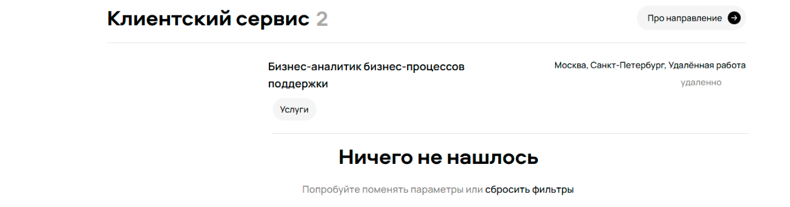                                                                                                                                       |

### Bug 5

| Поле                   | Значение                                                                                                                                                               |
|------------------------|------------------------------------------------------------------------------------------------------------------------------------------------------------------------|
| Название бага          | Некорректная работа фильтра по городу                                                                                                                                  |
| Подробное описание     | Фильтр "Санкт-Петербург" не отображает все вакансии из этого города.                                                                                                   |
| Шаги воспроизведения   | 1. Перейти на страницу карьерного сайта Авито. 2. Установить фильтры Data Science, Санкт-Петербург, можно удалённо, поддержка пользователей, руководящая должность |
| Ожидаемый результат    | Отображение вакансий только из Санкт-Петербурга.                                                                                                                       |
| Фактический результат  | Отобразились вакансии не только из Санкт-Петербурга.                                                                                                                   |
| Серьезность (Severity) | High (ошибка влияет на поиск вакансий по локации)                                                                                                                      |
| Приоритет (Priority)   | High (нужно срочно исправить)                                                                                                                                          |
| Вложения               | 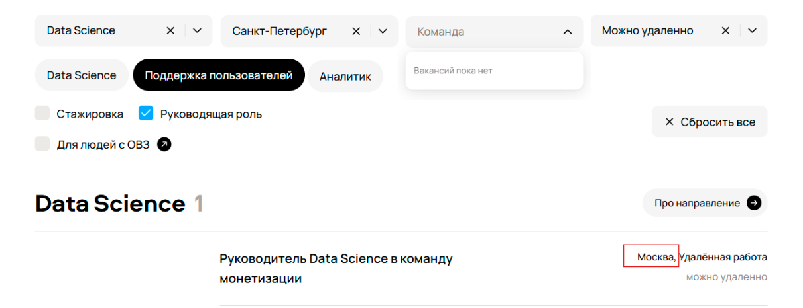     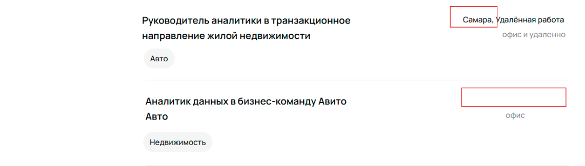                              |

### Bug 6

| Поле                   | Значение                                                                                                                                                               |
|------------------------|------------------------------------------------------------------------------------------------------------------------------------------------------------------------|
| Название бага          | У объявления о работе не указан город                                                                                                                                  |
| Подробное описание     | В объявлении о вакансии отсутствует информация о городе.                                                                                                               |
| Шаги воспроизведения   | 1. Перейти на страницу карьерного сайта Авито. 2. Установить фильтры Data Science, Санкт-Петербург, можно удалённо, поддержка пользователей, руководящая должность |
| Ожидаемый результат    | В объявлении должен быть указан город.                                                                                                                                 |
| Фактический результат  | Город не указан.                                                                                                                                                       |
| Серьезность (Severity) | Medium (отсутствие информации о локации может дезинформировать пользователя, влияет на качество предоставления услуг)                                                  |
| Приоритет (Priority)   | Medium (нужно исправить, но не срочно)                                                                                                                                 |
| Вложения               |                                                                                                                                         |

### Bug 7

| Поле                   | Значение                                                                                                                                                               |
|------------------------|------------------------------------------------------------------------------------------------------------------------------------------------------------------------|
| Название бага          | Некорректная работа фильтра формата работы                                                                                                                             |
| Подробное описание     | Фильтр "можно удаленно" не отображает все вакансии с таким форматом работы.                                                                                            |
| Шаги воспроизведения   | 1. Перейти на страницу карьерного сайта Авито. 2. Установить фильтры Data Science, Санкт-Петербург, можно удалённо, поддержка пользователей, руководящая должность |
| Ожидаемый результат    | Отображение вакансий только с форматом работы "можно удаленно".                                                                                                        |
| Фактический результат  | Отобразились вакансии не только с таким форматом работы.                                                                                                               |
| Серьезность (Severity) | High (ошибка влияет на поиск вакансий по формату работы)                                                                                                               |
| Приоритет (Priority)   | High (нужно срочно исправить)                                                                                                                                          |
| Вложения               | 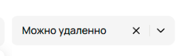  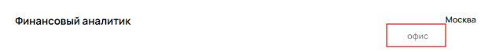 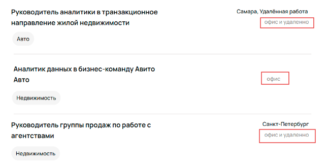                                |

### Bug 8

| Поле                   | Значение                                                                                                                                                               |
|------------------------|------------------------------------------------------------------------------------------------------------------------------------------------------------------------|
| Название бага          | Некорректное сообщение об отсутствии вакансий при выборе команды                                                                                                       |
| Подробное описание     | При выборе команды из выпадающего списка отображается сообщение "Вакансий пока нет", хотя правильнее было бы указать "Команд пока нет".                                |
| Шаги воспроизведения   | 1. Перейти на страницу карьерного сайта Авито. 2. Установить фильтры Data Science, Санкт-Петербург, можно удалённо, поддержка пользователей, руководящая должность |
| Ожидаемый результат    | Если команд нет, должно отображаться уточняющее сообщение: "Команд пока нет".                                                                                          |
| Фактический результат  | Отображается сообщение "Вакансий пока нет".                                                                                                                            |
| Серьезность (Severity) | Low (не влияет на функциональность, но может запутать пользователя)                                                                                                    |
| Приоритет (Priority)   | Low (не требует быстрого исправления)                                                                                                                                  |
| Вложения               | 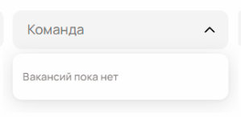                                                                                                                                         |
                                                                                                                                           |

### Bug 9

| Поле                   | Значение                                                                                                                                                                |
|------------------------|-------------------------------------------------------------------------------------------------------------------------------------------------------------------------|
| Название бага          | Лишние подкатегории в направлении Data Science                                                                                                                          |
| Подробное описание     | В фильтре направления Data Science отображаются лишние подкатегории: "поддержка пользователей" и "аналитика", которые не относятся к Data Science.                      |
| Шаги воспроизведения   | 1. Перейти на страницу карьерного сайта Авито. 2. Установить фильтры Data Science, Санкт-Петербург, можно удалённо, поддержка пользователей, руководящая должность. |
| Ожидаемый результат    | В фильтре Data Science должны отображаться только релевантные подкатегории, такие как Machine Learning, Data Engineering и т. д.                                        |
| Фактический результат  | Отображаются нерелевантные подкатегории: "поддержка пользователей" и "аналитика".                                                                                       |
| Серьезность (Severity) | Low (не влияет на функциональность, но может запутать пользователя)                                                                                                     |
| Приоритет (Priority)   | Low (можно исправить в следующих обновлениях)                                                                                                                           |
| Вложения               |                                                                                                                                             |

### Bug 10

| Поле                   | Значение                                                                                                                                                                |
|------------------------|-------------------------------------------------------------------------------------------------------------------------------------------------------------------------|
| Название бага          | В фильтре команды нет вариантов выбора                                                                                                                                  |
| Подробное описание     | На странице отображаются вакансии, у которых указаны команды, но эти команды не отображаются в фильтре по командам.                                                     |
| Шаги воспроизведения   | 1. Перейти на страницу карьерного сайта Авито. 2. Установить фильтры Data Science, Санкт-Петербург, можно удалённо, поддержка пользователей, руководящая должность. |
| Ожидаемый результат    | Команды, указанные в вакансиях должны отображаться и в фильтре по командам                                                                                              |
| Фактический результат  | Фильтр по командам пуст                                                                                                                                                 |
| Серьезность (Severity) | High (ошибка влияет на поиск вакансий)                                                                                                                                  |
| Приоритет (Priority)   | High (требуется срочное исправление)                                                                                                                                    |
| Вложения               |  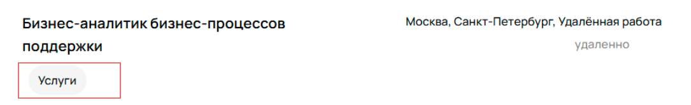 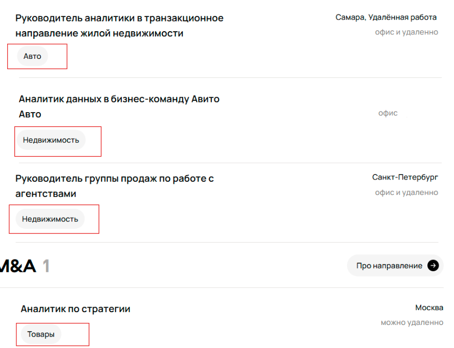                                                                 |

### Bug 11

| Поле                   | Значение                                                                                                                                                                |
|------------------------|-------------------------------------------------------------------------------------------------------------------------------------------------------------------------|
| Название бага          | Не работает фильтр для выбора поднаправления "Поддержка пользователей"                                                                                                  |
| Подробное описание     | При применении фильтра "Поддержка пользователей" отображаются вакансии, не относящиеся к этому поднаправлению.                                                          |
| Шаги воспроизведения   | 1. Перейти на страницу карьерного сайта Авито. 2. Установить фильтры Data Science, Санкт-Петербург, можно удалённо, поддержка пользователей, руководящая должность. |
| Ожидаемый результат    | Должны отображаться только вакансии, относящиеся к поднаправлению "Поддержка пользователей".                                                                            |
| Фактический результат  | Отображаются вакансии, не относящиеся к фильтру "Поддержка пользователей".                                                                                              |
| Серьезность (Severity) | High (ошибка влияет на релевантность поиска вакансий)                                                                                                                   |
| Приоритет (Priority)   | High (требуется срочное исправление)                                                                                                                                    |
| Вложения               | 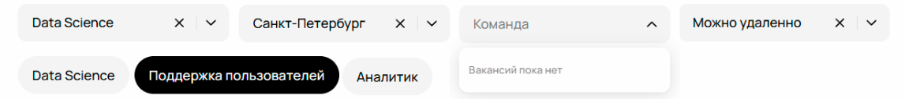                                                                                                                                           |

### Bug 12

| Поле                   | Значение                                                                                                                                                                        |
|------------------------|---------------------------------------------------------------------------------------------------------------------------------------------------------------------------------|
| Название бага          | Фильтр по руководящей должности работает некорректно                                                                                                                            |
| Подробное описание     | При применении фильтра "руководящая должность" отображаются вакансии, не относящиеся к руководящим должностям.                                                                  |
| Шаги воспроизведения   | 1. Перейти на страницу карьерного сайта Авито. 2. Установить фильтры Data Science, Санкт-Петербург, можно удалённо, поддержка пользователей, руководящая должность.         |
| Ожидаемый результат    | Должны отображаться только вакансии с руководящими должностями.                                                                                                                 |
| Фактический результат  | Отображаются вакансии без руководящих должностей.                                                                                                                               |
| Серьезность (Severity) | High (ошибка влияет на релевантность поиска вакансий)                                                                                                                           |
| Приоритет (Priority)   | High (требуется срочное исправление)                                                                                                                                            |
| Вложения               |   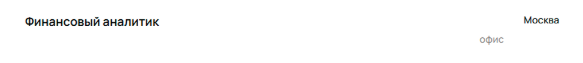   |
